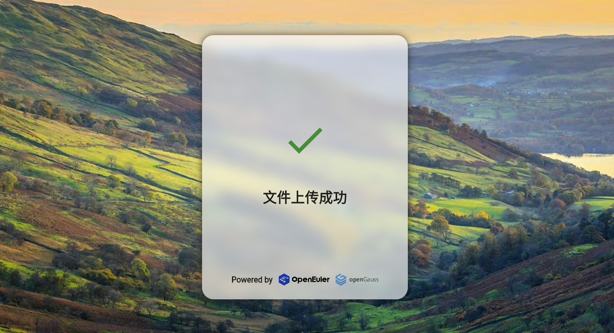

# A Simple File Collection System

### Abstract

With the development of information technology, the materials for daily office work and learning are gradually shifting towards digitalization. How to conveniently, efficiently, and securely collect various types of files has become a new pain point in terms of requirements. For teachers, they need to collect assignments from all students, while for administrators, they need to collect various form information from employees. In the face of these real-life scenarios, a file collection system is built based on the domestic open-source operating system openEuler and the database system openGauss to address the aforementioned challenges and make file collection more efficient, secure, and reliable. To achieve this system, the backend utilizes the SpringBoot framework, with data information recorded in GaussDB, while the frontend employs the Google Flutter framework to design the user interface, offering excellent cross-platform capabilities that support mainstream terminal platforms such as browsers, Windows, MAC, Linux, and iOS. The entire system possesses characteristics like aesthetics, user-friendliness, reliability, and ease of deployment, making it suitable for a wide range of application scenarios.

### Features

- Support deadline settings, catering to practical application scenarios.
- Automatically package collected files for convenient and time-saving one-click downloads.
- Basic access control functions to effectively prevent data leaks.
- Adopt cross-platform technology, with client support for mainstream platforms.
- Use systemd to manage services for easy deployment and startup/shutdown.
- Built with Flutter, featuring a beautiful interface and convenient and user-friendly operations.
- Built on openGauss and openEuler, ensuring security and stability.

### Screenshots

# 简单文件收集系统

22022年中国矿业大学华为智能基座软件与人工智能开发竞赛作品

基于Google Flutter、Springboot技术栈开发，使用了多项国产技术，如：openEuler操作系统、openGauss数据库、毕昇JDK等。